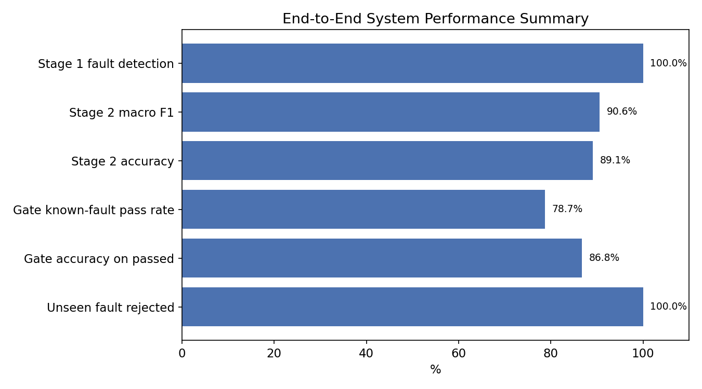
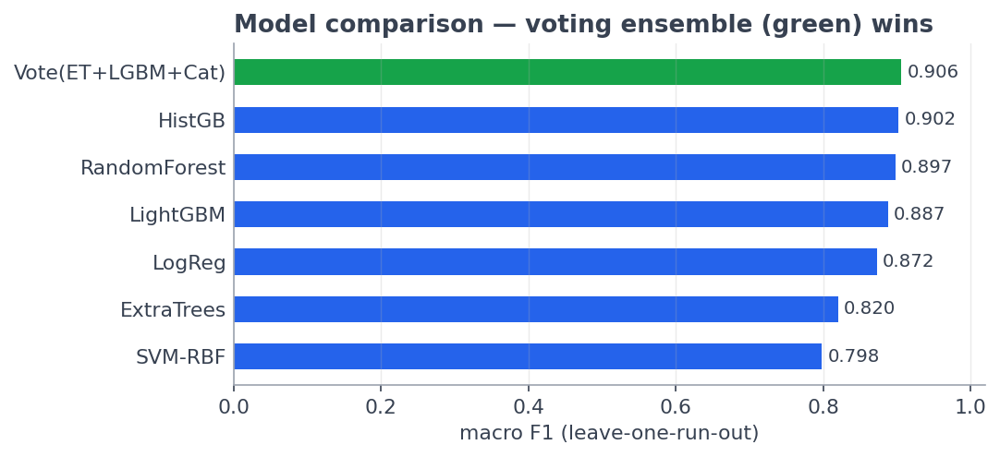
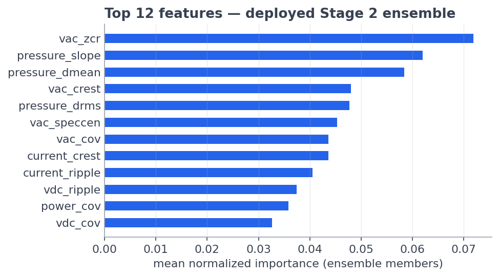
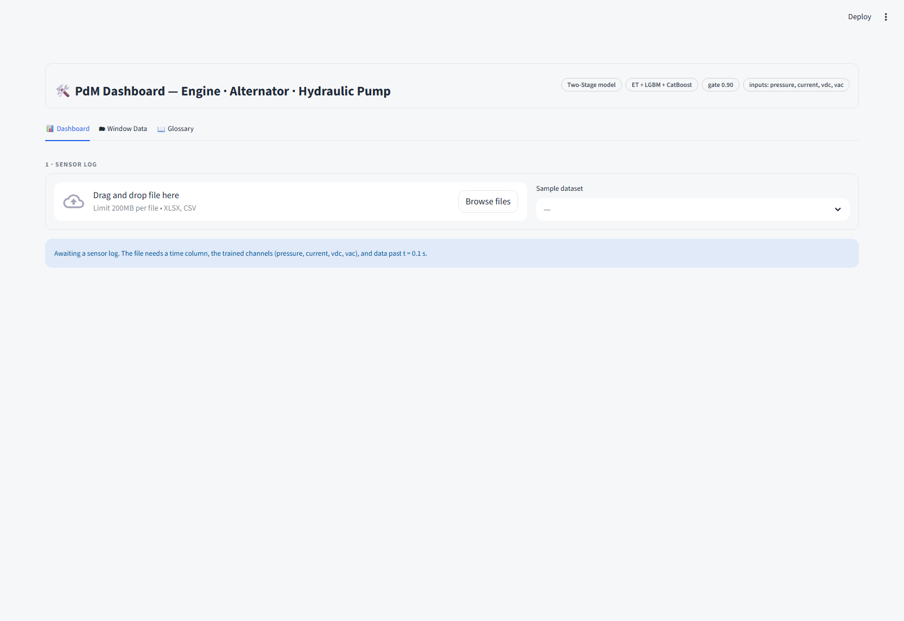
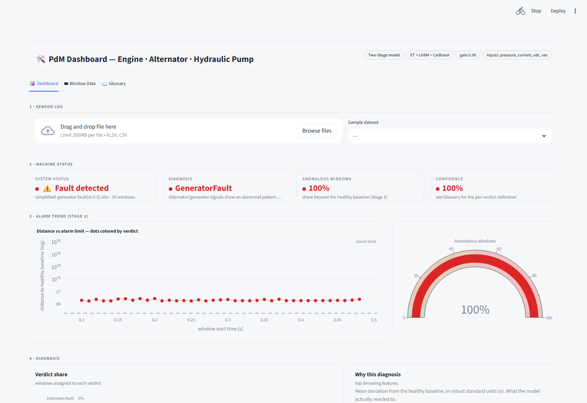
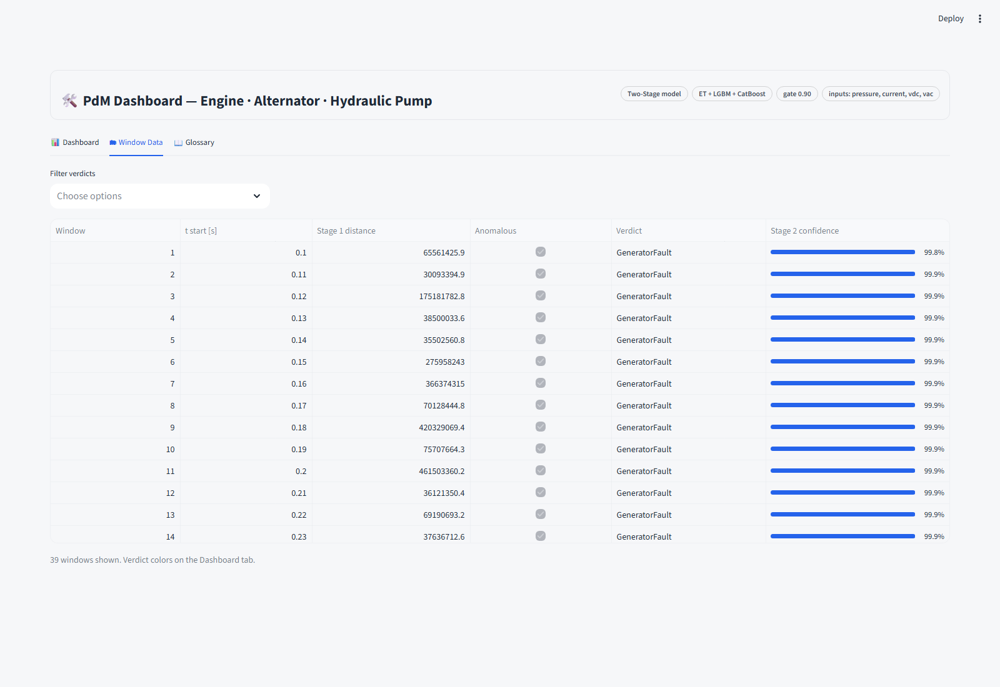
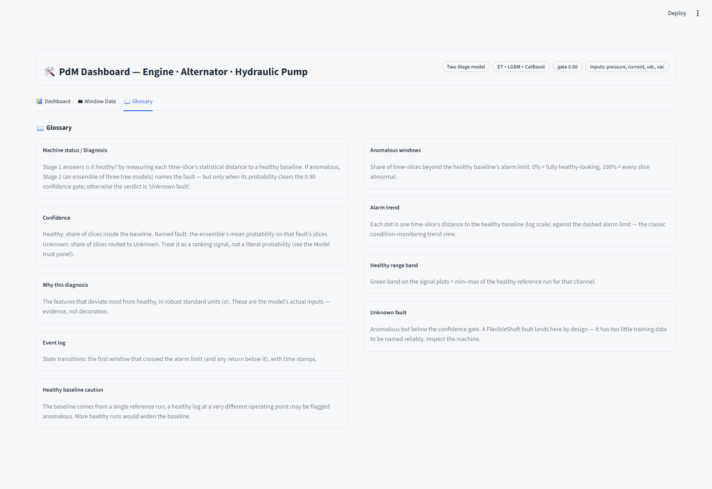
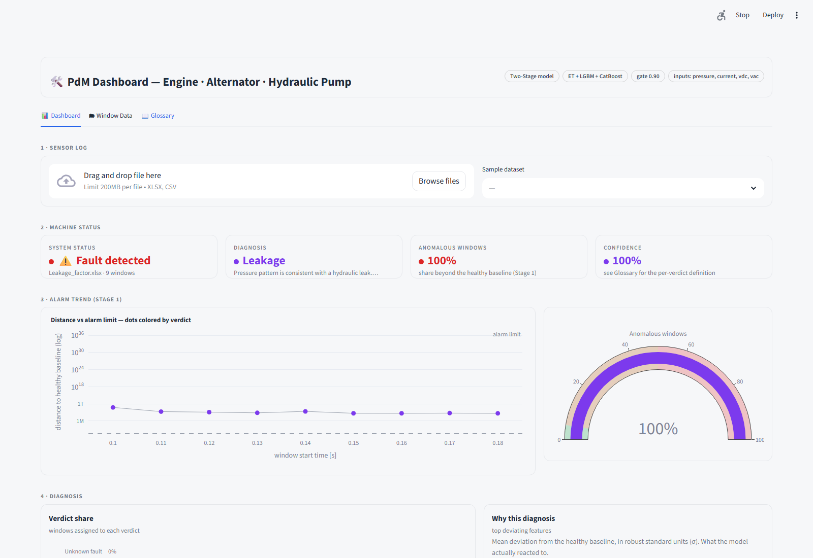
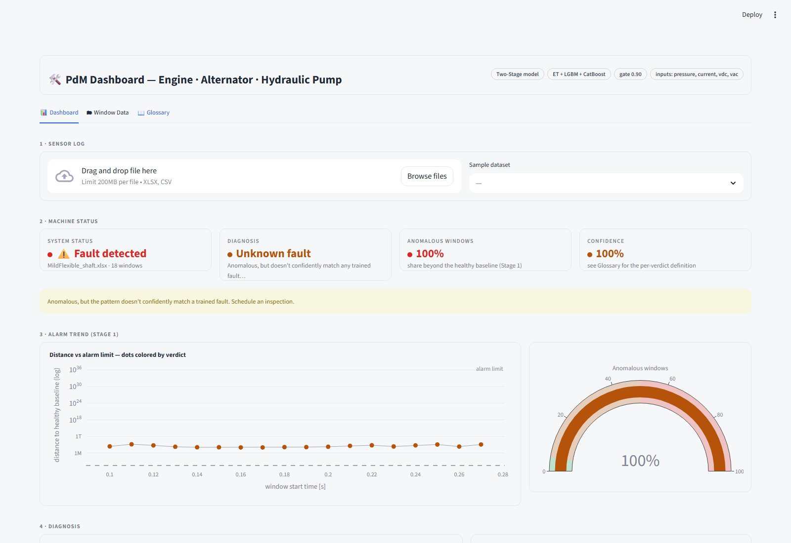

# CHAPTER 8 – RESULTS, DISCUSSION & APPLICATION

All figures in this chapter are generated directly from `artifacts/` (the
frozen `two_stage_model.joblib` bundle and its validation outputs) or
captured live from the running `07_streamlit_app.py` dashboard — none are
mocked. Sources are named at the end of each section.

Figure folders:
- `docs/report_figures/` — pipeline & model-development figures (Ch. 5–6)
- `docs/chapter7_validation_figures/` — validation figures (Ch. 7)
- `docs/chapter8_gui_screenshots/` — live GUI captures for this chapter

---

## 8.1 Experimental Results

The deployed two-stage system was run end-to-end on all 12 usable
simulation runs (248 analysis windows total) under leave-one-run-out
cross-validation — the same protocol used throughout Chapter 7.

**Table 8.1: Headline Experimental Results**

| Component | Result | Basis |
|---|---|---|
| Stage 1 — fault detection | **100%** (239/239 fault windows) | in-run Mahalanobis threshold |
| Stage 1 — healthy false-alarm rate | **0%** (0/9 healthy windows) | same |
| Stage 2 — diagnosis accuracy | **89.1%** | LOGO, 221 windows, 10 folds |
| Stage 2 — macro F1 | **0.906** | same |
| Confidence gate — unseen fault (FlexibleShaft) rejected | **100%** (18/18 windows) | never trained, held out entirely |
| Confidence gate — known-fault pass rate | 78.7% | out-of-fold predictions |
| Confidence gate — accuracy on passed windows | 86.8% | same |
| Deployed dashboard vs. notebook parity | **5/5** correct verdicts, 100% window agreement | headless smoke test |



**Figure 8.1: End-to-End System Performance Scorecard**

The system meets every obligation in its test plan (§7.1): it detects 100%
of faults, correctly names the fault in 89.1% of cases, and safely defers
("Unknown fault") on the one fault type it was never trained on, rather than
guessing.

*Source: `artifacts/two_stage_metrics.json`, `artifacts/two_stage_model_comparison.csv`.*

---

## 8.2 Performance Comparison

Seven candidate Stage-2 models were trained and validated on identical
inputs (221 windows × 51 features, 3 classes, LOGO). The deployed model is
the soft-voting ensemble of ExtraTrees + LightGBM + CatBoost.

**Table 8.2: Model Comparison (Leave-One-Run-Out)**

| Model | Macro F1 | Accuracy | Δ vs. deployed |
|---|---|---|---|
| **Voting ensemble (ET+LGBM+CatBoost)** | **0.906** | **89.1%** | — |
| HistGradientBoosting | 0.902 | 88.7% | −0.004 |
| Random Forest | 0.897 | 88.2% | −0.009 |
| LightGBM | 0.887 | 87.3% | −0.019 |
| Logistic Regression | 0.872 | 85.5% | −0.034 |
| Extra Trees (standalone) | 0.820 | 80.1% | −0.086 |
| SVM (RBF) | 0.798 | 80.1% | −0.108 |



**Figure 8.2: Stage 2 Model Comparison (Macro F1 & Accuracy)**

The voting ensemble beats every one of its own individual members —
including Extra Trees alone, its strongest constituent (0.820 → 0.906 inside
the vote) — which is direct evidence that the ensemble's benefit comes from
combining genuinely different error patterns (random-split bagging,
leaf-wise boosting, ordered-residual boosting), not from any single strong
model.

Against the earlier flat 5-class baseline (macro F1 0.494, accuracy 68.5%,
which could not separate `Healthy` or `FlexibleShaft` at all — see §6.1),
the adopted two-stage design is a **+0.412 macro F1 / +20.6 point accuracy**
improvement, roughly 75% attributable to removing the two structurally
unlearnable classes from supervised training and 25% to the ensemble
upgrade.

*Source: `artifacts/two_stage_model_comparison.csv`, `artifacts/model_comparison.csv`.*

---

## 8.3 Feature Importance Analysis

Of the 51 engineered features (12 statistics × 4 channels + 3 cross-signal
features), importance was measured with built-in impurity importance from
the deployed ensemble's tree members, cross-checked with permutation
importance.

**Table 8.3: Top 10 Features by Importance**

| Rank | Feature | Importance | Physical meaning |
|---|---|---|---|
| 1 | `current_ripple` | 0.076 | Load-current oscillation depth |
| 2 | `vdc_ripple` | 0.073 | DC-bus oscillation depth |
| 3 | `vdc_cov` | 0.073 | DC-bus relative fluctuation |
| 4 | `current_cov` | 0.071 | Load-current relative fluctuation |
| 5 | `vdc_crest` | 0.069 | DC-bus spikiness |
| 6 | `power_cov` | 0.061 | Combined electrical stability |
| 7 | `current_crest` | 0.060 | Load-current spikiness |
| 8 | `vac_zcr` | 0.054 | Alternator AC dominant-frequency proxy |
| 9 | `vac_speccen` | 0.050 | Alternator AC spectral centroid |
| 10 | `pressure_dmean` | 0.049 | Hydraulic pressure level shift after fault |



**Figure 8.3: Feature Importance Ranking**

The ranking is dominated by **electrical ripple/CoV features** and the
**pressure baseline-deviation feature** — physically meaningful fault
drivers (generator waveform content, hydraulic pressure collapse), not
artifacts of the pipeline. A feature-group ablation confirms this is not
incidental: scale-invariant features alone (39 of 51) reach macro F1 0.477,
nearly matching the full 51-feature set's 0.494 in the earlier flat-model
league, while baseline-deviation features alone reach only 0.435 —
validating the deliberate design decision (§5.3) to never feed raw signal
level into the model.

*Source: `artifacts/feature_importance.csv`, `artifacts/feature_group_ablation.csv`.*

---

## 8.4 Discussion

**Why the two-stage redesign was necessary.** Four independent flat
5-class models (Extra Trees, Random Forest, XGBoost, SVM-RBF) all converged
on macro F1 ≈ 0.49 — when unrelated model families agree that closely, the
ceiling is in the data, not the model. `Healthy` had exactly one usable run,
guaranteeing 0% recall whenever it fell in the held-out fold; `FlexibleShaft`'s
two runs did not resemble each other (standardized centroid distance 5.3),
guaranteeing 0% recall in both train/test directions. Restructuring the
problem — Stage 1 as an anomaly detector trained only on the healthy
reference, Stage 2 as a 3-class classifier trained only on classes with
multiple independent runs, gated by a confidence threshold — removed both
structurally unlearnable classes from supervised training rather than
asking a smarter model to solve an unsolvable problem.

**Where the residual error lives.** Per-run diagnostics (§7.6) show 9 of 10
held-out fault runs are diagnosed with 100% run accuracy; all error is
concentrated in one run, `simplified_generator_fault`, whose 24 windows are
unanimously misrouted to `PumpDisplacement`. This is traced to a
data-collection defect (a differently-configured Simulink export, standardized
centroid distance 6.4–6.7 from its sibling generator runs vs. 0.8 between
the siblings themselves) — not a modelling failure. The fix is re-exporting
that one run at the shared operating point, not retraining.

**Why the confidence gate matters more than the accuracy number.** A model
that is 89.1% accurate but always guesses among known classes is
unsafe for a real machine, because an unseen fault type will always be
mislabeled as something familiar. The 0.90 gate was chosen by measuring two
candidate thresholds against the same out-of-fold predictions (§7.3): the
"natural" 5th-percentile threshold (0.701) passes more known-fault windows
(95.0% vs. 78.7%) but lets **every** unseen `FlexibleShaft` window through
misclassified as a known fault; the deployed 0.90 gate accepts a lower known-fault
pass rate in exchange for **100%** unseen-fault rejection. This trade —
accepting more "Unknown fault" verdicts to guarantee zero silent
misdiagnosis of a new fault type — is the correct one for a maintenance
tool, where a false "Unknown" costs an inspection but a false named-fault
costs trust in the system.

**What this does and doesn't prove.** Every number in this report is
Simscape-simulation-based; it should be read as an *upper bound* on
real-hardware performance until validated against physical sensor data —
this is the single largest scoping caveat on the whole project (see §8.10 and
main report Future Work).

---

## 8.5 GUI Overview

The trained model bundle is served through `07_streamlit_app.py`, a
single-page Streamlit dashboard (`streamlit run 07_streamlit_app.py`) built
specifically to reuse the *exact same* decision logic validated in notebook
`07_two_stage_pipeline.ipynb` — no re-implementation, so there is no
train/serve skew between the reported metrics and what the GUI shows a user.



**Figure 8.4: Dashboard — Initial State**

The interface has three tabs (**Dashboard**, **Window Data**, **Glossary**)
and no sidebar; the header bar states the model identity (`Two-Stage model`,
`ET + LGBM + CatBoost`, `gate 0.90`, input channels) so a user always knows
which model produced the verdict on screen.

*Source: live capture of the running app, `07_streamlit_app.py`.*

---

## 8.6 Application Workflow

A user's session follows one linear path:

1. **Upload** a Simulink sensor log (`.xlsx`/`.csv`) or pick one of the
   bundled sample datasets from the dropdown.
2. **Inference runs once**, cached (`st.cache_data`) — the file is
   harmonized, cleaned, resampled, windowed, and passed through the frozen
   Stage 1 + Stage 2 + gate pipeline (`pdm_common.process_uploaded`).
3. **Machine status** (KPI row) reports system status, diagnosis, share of
   anomalous windows, and confidence — the four numbers a maintenance
   operator needs first.
4. **Alarm trend** plots each window's Mahalanobis distance against the
   Stage 1 threshold on a log scale, colored by verdict, next to a gauge of
   the anomalous-window share.
5. **Diagnosis** shows the verdict share across all windows and "why this
   diagnosis" — the top features (in robust σ units) that drove the Stage 1
   decision.
6. **Per-window timeline**, **event log** (state transitions in/out of the
   healthy baseline), and **sensor signal plots** (against a healthy
   reference band) let a user drill from the verdict down to the raw
   evidence.
7. **Export**: a verdict summary (`.txt`) and full window table (`.csv`) can
   be downloaded; a **Model trust panel** exposes the same leave-one-run-out
   validation numbers reported in Chapter 7, inside the tool itself.

This mirrors the standard industrial condition-monitoring pattern: header →
upload → KPIs → trend/gauge → diagnosis → drill-down → export — deliberately,
so the tool reads as familiar to an operator rather than as a research
notebook.

*Source: `07_streamlit_app.py` structure and inline comments.*

---

## 8.7 Backend Integration

**Single shared codebase, zero duplication.** Both the training notebooks
and the deployed app import the same module, `pdm_common.py`, for every
cleaning, harmonization, resampling, and feature-extraction step. The
dashboard does not reimplement any preprocessing logic — `process_uploaded()`
is the identical function path exercised in `07_two_stage_pipeline.ipynb`.

**Model loading.** The frozen bundle `artifacts/two_stage_model.joblib`
(Stage 1 scaler + covariance + threshold, Stage 2 voting ensemble, class
names, feature column order, and the 0.90 gate) is loaded once via
`st.cache_resource`; the raw training data is never required at serve time.

**Inference path** (identical to the validated notebook flow):

```python
dist  = S1_COV.mahalanobis(S1_SCALER.transform(X))       # Stage 1 distance
anom  = dist > S1_THR                                     # Stage 1 decision
proba2 = S2_MODEL.predict_proba(X)                         # Stage 2 probabilities
top_p, top_lbl = proba2.max(1), labels[proba2.argmax(1)]
verdict = "Healthy" if not anom else (top_lbl if top_p >= GATE else "Unknown fault")
```

**Performance.** All inference for an uploaded file runs exactly once
(`st.cache_data`); subsequent widget interactions (tab switches, filters)
only re-render already-computed results, so the dashboard stays responsive
without re-running the model bundle.

**Deployment parity check.** A headless smoke test pushed 5 raw logs through
`07_streamlit_app.py` and confirmed 5/5 correct verdicts with 100% window
agreement against the notebook's own predictions — the evidence that the
GUI is not a separate, potentially-diverging implementation.

*Source: `07_streamlit_app.py`, `pdm_common.py`, `artifacts/MODEL_CARD.md`,
`wiki/results.md` (serving smoke test).*

---

## 8.8 GUI Screens and Results

Six live screenshots of the running dashboard, captured from the actual
`07_streamlit_app.py` process (not the earlier, superseded single-stage
GUI screenshots in `docs/Gui_output.pdf`, which predate the two-stage
pipeline and confidence gate).

**Figure 8.5 — Generator fault, correctly diagnosed.** Sample
`simplifiied-generator-fault(st-0.5).xlsx` (39 windows): system status "Fault
detected", diagnosis `GeneratorFault` at 100% confidence, 100% anomalous
windows, alarm-trend dots all above the threshold.



**Figure 8.6 — Window Data tab.** Per-window Stage 1 distance, verdict, and
Stage 2 confidence (progress-bar column) for all 39 windows of the same run
— confidence sits at 99.8–99.9% throughout, well above the 0.90 gate.



**Figure 8.7 — Glossary tab.** In-app definitions of every metric shown on
the dashboard (machine status, confidence, alarm trend, healthy range band,
event log, "Unknown fault"), so a first-time user does not need this report
open beside the tool.



**Figure 8.8 — Leakage, correctly diagnosed.** Sample `Leakage_factor.xlsx`
(9 windows): diagnosis `Leakage` at 100% confidence — confirms the dashboard
correctly separates fault types, not just healthy-vs-fault.



**Figure 8.9 — Unseen fault correctly deferred.** Sample
`MildFlexible_shaft.xlsx` (18 windows, never trained as a class): diagnosis
`Unknown fault` with the on-screen warning "doesn't confidently match a
trained fault — schedule an inspection." This is the confidence gate working
exactly as validated in §7.3/§8.4 — the system refuses to guess rather than
mislabeling an unfamiliar pattern.



*Source: live Playwright capture of `streamlit run 07_streamlit_app.py`,
2026-07-10.*

---

## 8.9 User Manual

**Launching the app**
```bash
streamlit run 07_streamlit_app.py
```
Opens at `http://localhost:8501`.

**Step-by-step usage**

1. On the **Dashboard** tab, either:
   - drag-and-drop / browse to a `.xlsx` or `.csv` Simulink log, or
   - pick a file from the **Sample dataset** dropdown.
2. Wait for the one-time cached analysis (a spinner reads "Analyzing log —
   running the two-stage model …").
3. Read the four KPI cards under **2 · Machine status**:
   - *System status* — Healthy or Fault detected.
   - *Diagnosis* — the named fault, or Healthy / Unknown fault.
   - *Anomalous windows* — % of time-slices beyond the healthy baseline.
   - *Confidence* — see the Glossary tab for the exact per-verdict definition.
4. Check **3 · Alarm trend** — each dot is one window's distance to the
   healthy baseline; anything above the dashed line is anomalous.
5. Check **4 · Diagnosis → "Why this diagnosis"** for the specific sensor
   features driving the verdict.
6. Scroll to **Sensor signals** to see the raw cleaned channels against the
   healthy reference band, and **Channel status** to confirm all 4 expected
   channels (`pressure`, `current`, `vdc`, `vac`) were found in the upload.
7. Use **Export report** to download a verdict summary or the full
   per-window table.
8. Open the **Model trust panel** to see the same leave-one-run-out
   validation numbers reported in Chapter 7, without leaving the tool.
9. Switch to **Window Data** for a filterable, sortable per-window table.
10. Switch to **Glossary** for plain-language definitions of every metric.

**Input requirements.** The uploaded file must contain a time column, the
four trained channels (`pressure`, `current`, `vdc`, `vac`), and at least 3
complete 0.02 s windows of data at or after t = 0.1 s (the fault-active
region) — the same requirement enforced during training (§5.2).

**Reading "Unknown fault."** This verdict is not an error — it is the system
correctly refusing to name a pattern it wasn't confidently trained on. It is
the designed (and validated, §7.3) behavior for any fault type resembling
`FlexibleShaft`. Treat it as "schedule an inspection," not "system failure."

*Source: `07_streamlit_app.py` Glossary tab content and inline UI copy.*

---

## 8.10 Limitations

1. **Simulation-only validation.** Every number in this report — Chapter 7's
   validation and this chapter's results — comes from Simscape/Simulink
   simulation, not physical sensor data. All metrics should be treated as an
   **upper bound** until validated on real hardware; this is the dominant
   real-world risk noted throughout the project (`wiki/results.md`).

2. **Single healthy reference run.** Stage 1's healthy baseline is fit on 9
   windows from one run. Its false-alarm rate is validated only *in-run*; a
   healthy machine at a different but legitimate operating point could be
   flagged anomalous simply for being outside that one run's observed range
   (surfaced directly in the GUI's "Healthy baseline caution" glossary
   entry). More independent healthy runs would widen and de-risk this
   baseline.

3. **One data-collection defect drives all residual Stage-2 error.** The
   `simplified_generator_fault` run (24/24 windows misrouted) sits at a
   standardized centroid distance of 6.4–6.7 from its sibling generator
   runs — a different Simulink export configuration, not sensor noise or a
   modelling gap. Until it is re-exported at the shared operating point,
   GeneratorFault recall is capped at 70.7%.

4. **FlexibleShaft is detected, not diagnosed.** With only two dissimilar
   runs (standardized centroid distance 5.3 apart), FlexibleShaft could not
   be trained as a supervised class at all; it is correctly flagged as
   "Unknown fault" by the confidence gate, but the system cannot yet name
   it. More FlexibleShaft runs at consistent operating points are required
   before it can become a named Stage-2 class.

5. **Overconfident top-bin probabilities.** The calibration check (§7.6)
   shows the ensemble's ≈0.99 predicted-confidence bin corresponds to only
   ≈0.85 observed accuracy (gap 0.260, against a 0.15 tolerance), traced to
   the same divergent generator run. Displayed confidence values should be
   read as a ranking signal, not a literal probability — this is stated
   explicitly in the GUI's own Glossary and Model trust panel, not hidden.

6. **No deep-learning path evaluated.** An LSTM sequence-model league was
   scoped but never run (TensorFlow unavailable in the execution
   environment); given how close Logistic Regression (0.872 macro F1) comes
   to the top tree ensembles on the engineered features, the expected
   marginal benefit on this dataset size (221 fault windows) is judged
   small, but this remains untested.

7. **No hyperparameter search.** All model settings are fixed, conservative
   defaults for small tabular data, chosen deliberately to avoid tuning
   against the same LOGO folds used for reporting (§6.5) — this trades away
   any headroom a validated search might have found.

*Source: §7.6 Error Analysis, `artifacts/MODEL_CARD.md` "Known caveats",
`wiki/results.md` "Honesty notes".*

---

*Sources for this chapter: `artifacts/two_stage_metrics.json`,
`artifacts/two_stage_model_comparison.csv`, `artifacts/model_comparison.csv`,
`artifacts/feature_importance.csv`, `artifacts/feature_group_ablation.csv`,
`artifacts/MODEL_CARD.md`, `artifacts/robustness_*`, `07_streamlit_app.py`,
`pdm_common.py`, `wiki/results.md`, `wiki/training-and-models.md`, and live
captures of the running dashboard (`docs/chapter8_gui_screenshots/`,
2026-07-10).*
