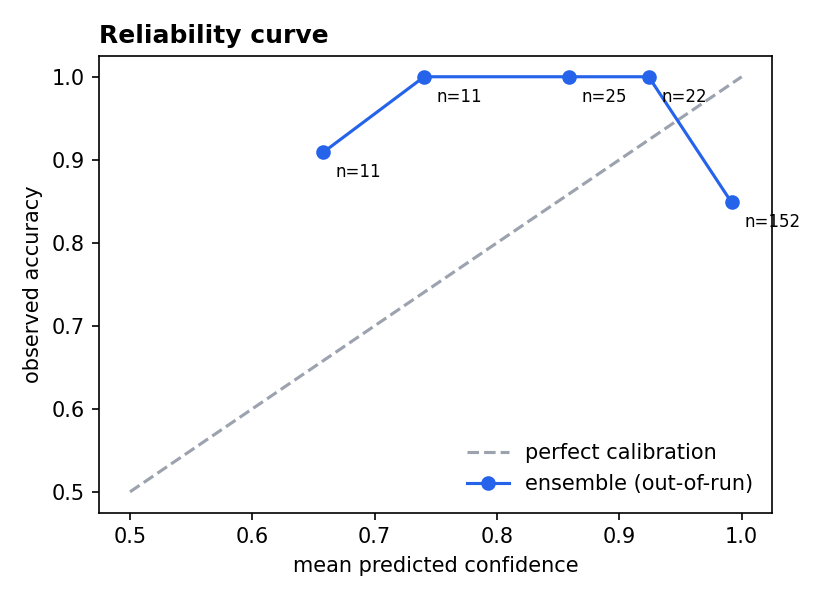

# CHAPTER 5 – DATA PREPROCESSING & FEATURE ENGINEERING

## 5.1 Data Cleaning

All cleaning logic lives in a single shared module, `pdm_common.py`, so that
training and the deployed Streamlit app run through **exactly the same** code
path (zero train/serve skew). Cleaning is executed in notebooks
`01_load_harmonize_clean.ipynb` and `02b_validate_channels.ipynb`, and proceeds
in five stages:

**1. Column harmonization and unit conversion.** The raw Simulink/Simscape
exports (`.xlsx` / `.csv`) name the same physical channel differently across
the 12 simulation runs — suffixes such as `:1`, generic
`PS-Simulink Converter` labels, and inconsistent capitalisation. A
suffix/whitespace-tolerant resolver maps every export scheme onto one
canonical channel set (`pressure`, `current`, `vdc`, `vac`, `speed`, `torque`,
`flow`, `fuel`, `time`) with unit conversion where required (e.g. Pa → bar).
Every accept/reject decision is logged, per channel and per file, in
`artifacts/channel_validation.csv` — nothing is dropped silently.

**2. Duplicate removal.** Exact duplicate rows and duplicate timestamps within
a run are counted and removed; duplicated samples would otherwise
double-weight sections of the signal and corrupt the resampling step.

**3. Physically-impossible value sanitisation.** Values that violate physics —
negative pressure, negative flow, negative fuel rate — are flagged as missing
(`NaN`) rather than clipped or silently kept. This bound is a physics fact
(≥ 0), not a tuned threshold, so it cannot overfit the data. Flagged values
are filled by the same interpolation path used for any other missing sample.

**4. Uniform resampling to 10 kHz.** The Simulink variable-step solver
produces non-uniform timestamps; every channel is linearly interpolated onto
one common 10 kHz grid starting at t = 0.05 s (discarding the solver's
non-physical start-up transient). A constant sampling rate is required
downstream for the spectral and windowed features (§5.4).

**5. Outlier clipping — Hampel filter.** A rolling-median filter replaces any
sample further than a robust threshold (median ± k·MAD) from its local
neighbourhood. This was chosen over a low-pass or mean-smoothing filter
specifically because it removes isolated solver spikes **without smoothing
over genuine fault dynamics** — a real step change in the signal survives; a
one-sample glitch does not. Limitation: a burst of several consecutive bad
samples would only be partially corrected.

**6. Constant-column and low-variance filtering.** A channel is dropped only
if it is constant across the **entire dataset** (a channel that is flat in
just one run is retained, since it may still be informative in others).
After feature extraction, features with near-zero variance across all
windows are removed as well, since they carry no class information and only
add noise dimensions to the Stage‑1 covariance estimate (§8 of the main
report).


**Figure 5.1: Cleaned Signals — Healthy Run vs. Leakage Fault Run**

Two data-quality defects were also caught (and are tracked, not silently
patched): `Leakage_factor.xlsx` has column labels that appear scrambled at
source (its `Load_Current` range matches the *torque* range of the CSV
leakage runs), and one `simplified_generator_fault` run was exported with
different Simulink settings than its two sibling runs — both are flagged as
data-collection issues, not pipeline bugs.

## 5.2 Windowing Strategy

After cleaning, each run is cut into **0.02 s windows of 200 samples with 50%
overlap**, taken only from the fault-active region (t ≥ 0.1 s, i.e. after the
fault injection instant). Each window inherits the label of its parent run. A
run must yield at least 3 complete windows to be usable at all.

- **Why windows, not whole runs?** Twelve raw runs would give only twelve
  training examples — far too few to fit or validate a classifier. Windowing
  multiplies the sample count while each window still spans several
  electrical/hydraulic cycles at the 10 kHz sampling rate.
- **Why 50% overlap?** Standard practice in vibration/condition monitoring —
  it doubles the sample count and guarantees no transient of interest falls
  exactly on a window boundary.
- **Known limitation, addressed downstream:** overlapping windows from the
  same run are statistically dependent (near-duplicates of each other, same
  operating point, same noise seed). This is precisely why validation is
  never done by randomly splitting windows, but by **leave-one-run-out**
  cross-validation (Chapter 7).

**Resulting window counts per run** (`artifacts/window_counts.csv`):

**Table 5.1: Analysis Windows per Class**

| Class | Runs contributing | Windows |
|---|---|---|
| PumpDisplacement | 4 | 96 |
| GeneratorFault | 3 | 82 (24 + 19 + 39, one run diverges — §7.6) |
| Leakage | 3 | 43 |
| FlexibleShaft | 1 (used) | 18 (the second flex run was excluded by project decision) |
| Healthy | 1 | 9 |
| **Total** | **12** | **248** |


**Figure 5.2: Analysis Windows per Class**

## 5.3 Scaling & Normalization

Scaling is applied selectively, matched to what each downstream stage
actually needs:

- **Stage 1 (health monitor):** every feature is centred and scaled with a
  **`RobustScaler`** fitted on the 9 healthy windows only — using the healthy
  **median** and **IQR**, not mean/standard deviation, so that a single
  unusual value cannot distort the scale. After scaling, a value of 0 means
  "typical healthy value" for every one of the 51 features.
- **Stage 2 tree/boosting models** (Extra Trees, Random Forest,
  HistGradientBoosting, LightGBM, CatBoost, XGBoost): **no scaling** — split
  points in a decision tree are invariant to monotonic rescaling, so scaling
  would add compute for zero benefit.
- **Stage 2 margin/linear models** (SVM-RBF, Logistic Regression): a
  **`StandardScaler`** is applied inside an sklearn pipeline, since both
  algorithms are distance/gradient-based and sensitive to feature scale.
- **Design-level normalisation (upstream of all of the above):** because the
  12 runs sit at wildly different absolute operating points (pump pressure
  spans 0.03–4126 bar across runs; DC bus spans 26–182 V), *raw signal level*
  is never used as a feature at all — every one of the 51 features is either
  scale-invariant (a ratio/shape statistic) or baseline-relative (a deviation
  from that same run's own pre-fault segment). This is enforced at feature
  **design** time, before any scaler is fit, and is the single most important
  normalisation decision in the pipeline (see §5.4 and the ablation in §5.5).

## 5.4 Feature Extraction

Feature extraction runs in `04_feature_extract.ipynb` and produces
`artifacts/features.parquet` (cached alongside the raw windows in
`artifacts/windows.npz`). Twelve statistics are computed per window for each
of the four channels common to all 12 runs (`pressure`, `current`, `vdc`,
`vac`), plus three cross-signal features, for **12 × 4 + 3 = 51 features**:

**Table 5.2: Feature Set (12 × 4 Channels + 3 = 51 Features)**

| Feature Name | Definition | What It Captures |
|---|---|---|
| Coefficient of Variation (`cov`) | σ/µ (standard deviation / mean) | Relative fluctuation strength |
| Crest Factor (`crest`) | Peak / RMS | Spikiness of the waveform |
| Ripple Factor (`ripple`) | Peak-to-peak / mean | Oscillation depth |
| Skewness (`skew`) | Third standardized moment | Waveform asymmetry |
| Kurtosis (`kurt`) | Fourth standardized moment | Heavy tails / impulsiveness |
| Zero-Crossing Rate (`zcr`) | Zero-crossing rate of the detrended signal | Dominant frequency proxy |
| Slope / Linear Trend (`slope`) | Linear trend within the window | Drift / collapse behaviour |
| Spectral Centroid (`speccen`) | Centroid of the frequency spectrum | Centre of gravity of the spectrum |
| Low-Band Spectral Power Ratio (`speclow`) | Low-band spectral power share | Energy shift toward low frequency |
| Mean Deviation from Baseline (`dmean`) | Mean change vs. pre-fault baseline (normalized) | Level shift after fault |
| Standard Deviation Change from Baseline (`dstd`) | Std. dev. change vs. baseline (normalized) | Fluctuation change after fault |
| RMS Deviation from Baseline (`drms`) | RMS change vs. baseline (normalized) | Energy change after fault |
| VDC–Current Correlation (`corr_vdc_i`) | Correlation(VDC, Current) | Rectifier / load coupling integrity |
| Power Coefficient of Variation (`power_cov`) | CoV of instantaneous electrical power | Combined electrical stability |
| Pressure–VAC Correlation (`corr_p_vac`) | Correlation(Pressure, VAC) | Hydro-electrical coupling |

The baseline-deviation features (`dmean`, `dstd`, `drms`) are computed
relative to each run's own pre-fault segment (0.05–0.10 s), which is what
lets the same feature be compared meaningfully across runs recorded at
different absolute operating points.

## 5.5 Feature Selection

**No features are removed by rank before training.** All 51 features enter
every model in the final pipeline — selecting a subset by importance
*before* cross-validation would itself leak information from the held-out
test folds back into feature choice.

Feature importance is instead computed and used purely as **evidence**, not
as a filter: impurity (`builtin`) importance from the deployed ensemble's
tree members, cross-checked with permutation importance during development
(`artifacts/feature_importance.csv`; SHAP was preferred but hit an
environment `ValueError` on this numpy/shap version pairing, so permutation +
built-in importance were used instead, giving the same qualitative
conclusion). The top-ranked features are (Figure 5.3):


**Figure 5.3: Feature Importance Ranking**

**Table 5.3: Top 10 Feature Importance Ranking**

| Rank | Feature | Importance |
|---|---|---|
| 1 | `current_ripple` | 0.076 |
| 2 | `vdc_ripple` | 0.073 |
| 3 | `vdc_cov` | 0.073 |
| 4 | `current_cov` | 0.071 |
| 5 | `vdc_crest` | 0.069 |
| 6 | `power_cov` | 0.061 |
| 7 | `current_crest` | 0.060 |
| 8 | `vac_zcr` | 0.054 |
| 9 | `vac_speccen` | 0.050 |
| 10 | `pressure_dmean` | 0.049 |

The ranking is dominated by electrical ripple/CoV features and the pressure
baseline-deviation features — physically meaningful drivers (generator
waveform content, hydraulic pressure collapse after a fault) rather than
artifacts, which is evidence the model learned machine physics.

A **feature-group ablation** (`artifacts/feature_group_ablation.csv`, run
during the earlier flat-classifier exploration) directly tested the
scale-invariance design claim by scoring the classifier on each feature group
in isolation:

**Table 5.4: Feature-Group Ablation**

| Feature group | # Features | Macro F1 |
|---|---|---|
| All features | 51 | 0.494 |
| Scale-invariant only | 39 | 0.477 |
| Baseline-deviation only | 12 | 0.435 |

Scale-invariant features alone carry almost all of the signal, confirming
that the design decision to exclude raw signal level was correct rather than
merely convenient.

## 5.6 Final Processed Dataset

The processed dataset that feeds every model in Chapter 6 consists of:

**Table 5.5: Final Processed Dataset Summary**

| Property | Value |
|---|---|
| Cached windows | `artifacts/windows.npz` |
| Cached feature table | `artifacts/features.parquet` |
| Total analysis windows | 248 |
| Windows used for Stage 2 (fault classes only) | 221 (Leakage 43 + PumpDisplacement 96 + GeneratorFault 82) |
| Windows used for Stage 1 baseline | 9 (Healthy) |
| Windows held out as the open-set validator | 18 (FlexibleShaft, `Mild` run) |
| Features per window | 51 |
| Input channels | `pressure`, `current`, `vdc`, `vac` |
| Simulation runs | 12 used (of 13 collected; `Medium_FlexibleShaft_Fault` excluded by project decision) |
| Excluded run | `Medium_FlexibleShaft_Fault` — does not generalise to the `Mild` flex run (§7.6) |

This table (`features.parquet`, indexed by run/window with a `label` column)
is the single artifact consumed by every model comparison in Chapter 6 and
every validation number in Chapter 7.

---

# CHAPTER 6 – MODEL DEVELOPMENT

## 6.1 Model Development Strategy

The project went through two architectures, and the switch between them is
the single largest driver of the final result.

**Original design (rejected):** one flat 5-class classifier
(`Healthy` / `Leakage` / `PumpDisplacement` / `GeneratorFault` /
`FlexibleShaft`), validated with leave-one-run-out (LOGO) cross-validation.
Four different models (Extra Trees, Random Forest, XGBoost, SVM-RBF) all
landed within ~1% macro F1 of each other at **macro F1 ≈ 0.49, accuracy ≈
68.5%** (`artifacts/model_comparison.csv`). When independent model families
agree that closely, the ceiling is in the *data*, not the *model*: Healthy has
exactly one usable run, so whenever it falls in the held-out fold, the
training fold contains zero healthy examples — Healthy recall is
mathematically guaranteed to be 0%. FlexibleShaft's two runs (`Mild`,
`Medium`) do not resemble each other (standardized centroid distance 5.3 vs.
~2–4 to other classes), so training on one and testing on the other also
guarantees 0% both directions. Two guaranteed-zero classes out of five cap
macro F1 at roughly 3/5 of whatever the three good classes achieve.

**Adopted design — two-stage pipeline** (`07_two_stage_pipeline.ipynb`,
`artifacts/two_stage_model.joblib`):

1. **Stage 1 — Health Monitor:** a one-class Mahalanobis-distance anomaly
   detector, trained only on the healthy run, decides *healthy vs.
   anomalous*. This removes the unlearnable "Healthy" class from supervised
   training entirely and instead treats it as a reference distribution.
2. **Stage 2 — Fault Diagnoser:** a supervised classifier trained only on the
   three fault classes that have multiple independent runs (Leakage,
   PumpDisplacement, GeneratorFault), each evaluated under LOGO.
3. **Confidence gate:** Stage 2 only names a fault when its top predicted
   probability is ≥ 0.90; below that, the window is reported "Unknown fault"
   — this is what lets FlexibleShaft (never trained as a class) be handled
   safely instead of mislabeled.


**Figure 6.1: Stage 1 Mahalanobis-Distance Separation (Healthy vs. Fault Windows)**

Restructuring the problem this way — not switching to a "smarter" model —
produced ~75% of the total improvement (flat ExtraTrees at 3 classes already
reaches 0.820 macro F1, up from 0.494); the remaining gain came from
upgrading the single classifier to a diversified voting ensemble (§6.3).

**Hyperparameter philosophy:** no hyperparameter search was run against the
test folds. All settings are standard, conservative defaults appropriate for
a small tabular dataset (500 trees for bagging methods; shallow trees /
slow learning rate for boosting) — see §6.5.

## 6.2 Classical Machine Learning Models

All Stage‑2 candidates were evaluated on identical inputs — 221 windows × 51
features, 3 classes, leave-one-run-out cross-validation
(`artifacts/two_stage_model_comparison.csv`).

**Table 6.1: Stage 2 Candidate Model Comparison**

| Model | Macro F1 | Accuracy |
|---|---|---|
| **Voting ensemble (ET+LGBM+CatBoost)** | **0.906** | **89.1%** |
| HistGradientBoosting | 0.902 | 88.7% |
| Random Forest | 0.897 | 88.2% |
| LightGBM | 0.887 | 87.3% |
| Logistic Regression | 0.872 | 85.5% |
| Extra Trees | 0.820 | 80.1% |
| SVM (RBF) | 0.798 | 80.1% |


**Figure 6.2: Stage 2 Model Comparison (Leave-One-Run-Out, Macro F1 & Accuracy)**

### Random Forest
Bagging of 500 decision trees, each trained on a bootstrap resample of the
windows with a random feature subset considered at each split, combined by
majority vote (`RandomForestClassifier(500, class_weight="balanced",
random_state=42)`). It is the standard strong tabular baseline and scored
0.897 / 88.2% — close behind the deployed ensemble. Individual trees are
wrong in different, uncorrelated ways, so the majority vote cancels out most
of their errors.

### Support Vector Machine (SVM)
An RBF-kernel maximum-margin classifier
(`SVC(C=10, class_weight="balanced", probability=True)`) inside a
`StandardScaler` pipeline. It was the weakest model tested, at 0.798 / 80.1%.
With 51 features, 221 windows, and a real distribution shift between train
and held-out runs, its carefully-fit margin generalises worse than a tree
vote; its Leakage recall (63%) was the main drag. Its inclusion served as a
classical, non-tree sanity check on the feature space.

### XGBoost
A regularized gradient-boosting implementation, tested during the earlier
feature-league exploration (`05_train_compare.ipynb`,
`artifacts/model_comparison.csv`) where it scored **macro F1 0.465 / accuracy
68.5%** — in line with the other flat 5-class models, i.e. capped by the same
Healthy/FlexibleShaft data ceiling described in §6.1. In the two-stage
pipeline it was tested again and scored comparably to HistGradientBoosting,
but it **errors on LOGO folds where a class is entirely missing from the
training set** (which happens whenever a rare class's only runs are all held
out); it was therefore dropped from the final Stage‑2 candidate set in favour
of HistGradientBoosting, LightGBM, and CatBoost, which handle this
gracefully.

### Extra Trees
Bagging of 500 trees like Random Forest, but each split threshold is chosen
**at random** rather than searched for optimality
(`ExtraTreesClassifier(500, class_weight="balanced", random_state=42)`).
Scored 0.820 / 80.1% as a standalone model — the extra randomness usually
reduces overfitting, but with only 10 available training runs, random splits
often land in uninformative places; GeneratorFault recall for standalone
Extra Trees was only ~50% (vs. ~70% for boosted models), which explains its
weaker solo rank. It is nonetheless one of the three members of the deployed
voting ensemble, where its high-randomness errors partially cancel against
the other two members' errors.

### LightGBM
Gradient boosting with leaf-wise tree growth and histogram-binned features
(`LGBMClassifier(n_estimators=400, num_leaves=15, learning_rate=0.05,
class_weight="balanced", random_state=42)`). Scored 0.887 / 87.3% standalone.
Boosting builds trees in sequence, each one fitting the previous ensemble's
residual errors, which focuses model capacity on the hardest cases — here,
separating GeneratorFault from PumpDisplacement. Leaf-wise growth can overfit
small data, which is why leaf count is capped at 15 and the learning rate
kept low (0.05).

### CatBoost
Gradient boosting using **ordered boosting**
(`CatBoostClassifier(iterations=400, depth=4, learning_rate=0.05)`), in which
each sample's residual is computed from a model that never saw that sample —
a mechanism specifically designed to resist overfitting on small datasets
like this one (221 windows). It is not reported as a standalone row in Table
6.1 because it is evaluated only as an ensemble member, but its ordered-
boosting property is one of the two reasons (with LightGBM's leaf-wise
boosting and Extra Trees' randomised bagging) the three chosen members make
*different kinds* of mistakes — the property the ensemble exploits (§6.3).

## 6.3 Ensemble Learning Framework

The deployed Stage‑2 classifier is a **soft-voting ensemble** of three
diversified members:

```python
VotingClassifier([
    ("et",   ExtraTreesClassifier(500, class_weight="balanced", random_state=42, n_jobs=-1)),
    ("lgbm", LGBMClassifier(n_estimators=400, num_leaves=15, learning_rate=0.05,
                             class_weight="balanced", random_state=42, verbosity=-1)),
    ("cat",  CatBoostClassifier(iterations=400, depth=4, learning_rate=0.05, ...)),
], voting="soft")
```

Soft voting averages the three members' predicted **class probabilities**
and picks the class with the highest average — as opposed to hard voting,
which would only average discrete predicted labels. This was chosen because:

- **The three members make different kinds of mistakes.** Extra Trees is
  high-randomness bagging, LightGBM is leaf-wise sequential boosting, and
  CatBoost is ordered-residual boosting. Averaging retains the signal the
  three agree on and washes out each member's individual quirks.
- **The ensemble beats every individual member**, including its own
  strongest constituent (Extra Trees alone: 0.820 → inside the ensemble:
  0.906).
- **Averaged probabilities are better calibrated** than any single member's,
  which the downstream confidence gate directly depends on (§10 of the main
  report).
- **Class imbalance** (43 / 96 / 82 windows across the three classes) is
  handled by `class_weight="balanced"` in every member, giving each class
  equal weight in the loss — not by synthetic oversampling (e.g. SMOTE),
  which was deliberately avoided: interpolating between overlapping windows
  of the same run would manufacture fake "independent" samples and corrupt
  the leave-one-run-out validation.

## 6.4 Deep Learning Model (LSTM)

A sequence-model path was scoped alongside the classical/ensemble path in
`05_train_compare.ipynb`, structured as two independent "leagues" that are
never cross-ranked: a **feature league** (Random Forest / Extra Trees /
XGBoost / SVM on the 51 engineered features) and a **sequence league** (an
LSTM trained directly on raw window sequences, without hand-engineered
features), with the sequence league gated to run "only if TensorFlow is
installed."

TensorFlow was **not available in the project's execution environment**, so
the LSTM league did not run; `artifacts/model_comparison.csv` records only
the feature-league results, with the sequence league explicitly noted as
skipped (`wiki/results.md`). No LSTM model was therefore trained, tuned, or
evaluated, and **no deep-learning results are reported** in this project —
the deployed system is entirely classical machine learning (Chapter 6.2–6.3).

This is consistent with the size of the dataset: with only 12 usable
simulation runs (221 fault windows), a sequence model with materially more
parameters than the ~50-feature tree ensembles would be expected to overfit
before it could learn a signal the tree ensembles could not already extract
— the Logistic Regression result (0.872 macro F1 with a linear decision
boundary, §6.2) is itself evidence that the engineered feature space is
already close to linearly separable, so the marginal benefit of a deep
sequence model on this dataset size is expected to be small. Enabling the
LSTM league (installing TensorFlow and re-running the sequence league in
`05_train_compare.ipynb`) is noted as a natural extension once more
simulation runs are collected (see Chapter 7.6 / main report §15, Future
Work).

## 6.5 Hyperparameter Tuning

No formal search (grid search / randomized search / Bayesian optimisation)
was run against the validation folds, by deliberate design choice, for two
reasons: (1) with only 10–12 usable runs and leave-one-run-out folds, tuning
hyperparameters against those same folds would itself be a leakage channel —
the reported metrics would stop being an honest estimate of out-of-run
performance; and (2) the dataset is small enough that standard, conservative
default settings for small tabular data are already appropriate and unlikely
to be meaningfully beaten by a search that could just as easily overfit the
folds it is scored on.

The settings actually used were chosen once, from standard practice for
small-sample tabular boosting/bagging, and then frozen:

**Table 6.2: Model Hyperparameter Configuration**

| Model | Configuration | Rationale |
|---|---|---|
| Extra Trees | 500 trees, `class_weight="balanced"`, `random_state=42` | more trees than strictly needed cost little extra compute and reduce variance |
| Random Forest | 500 trees, `class_weight="balanced"`, `random_state=42` | same |
| LightGBM | 400 iterations, `num_leaves=15`, `learning_rate=0.05`, `class_weight="balanced"` | shallow leaves + slow learning rate is the standard guard against boosting overfitting on ~221 samples |
| CatBoost | 400 iterations, `depth=4`, `learning_rate=0.05` | shallow depth + slow learning rate, same rationale; ordered boosting adds a second overfitting guard |
| SVM-RBF | `C=10`, `class_weight="balanced"`, `probability=True` | moderate regularisation strength for the RBF margin |
| Logistic Regression | `max_iter=2000`, `class_weight="balanced"` | run to convergence; no regularisation search performed |

**Stage 1** has one tuned constant: the anomaly threshold, set at
**1.5 × the worst (maximum-distance) healthy window** — a documented safety
margin above the empirical healthy maximum, not a value fit to the fault
data. **Stage 2** has one tuned constant: the **confidence gate at 0.90**,
which was itself selected by comparing two candidate values against
measured outcomes rather than chosen arbitrarily (§7.3 below; main report
§10.1).

## 6.6 Training Methodology

1. **Data split unit = simulation run, never a window.** Every training run
   uses `LeaveOneGroupOut` (scikit-learn) with `groups = run_id`, so that no
   window from a held-out run's sibling windows ever appears in the training
   fold. This is the single most important methodological decision in the
   project (§7.3).
2. **Stage 1 training set:** the 9 windows of the one healthy run only. A
   `RobustScaler` and a `LedoitWolf`-shrinkage covariance are fit on this set;
   Ledoit-Wolf shrinkage is required specifically because a plain sample
   covariance matrix is singular whenever the sample count (9) is smaller
   than the feature count (51).
3. **Stage 2 training set:** 221 windows across the three fault classes
   (Leakage, PumpDisplacement, GeneratorFault); `FlexibleShaft` windows are
   never used in Stage 2 training — they are reserved entirely as an
   out-of-distribution validation set for the confidence gate (§7.3/§7.6).
4. **Per-fold procedure:** for each of the 10 fault runs, train Stage 2 on
   the other 9 runs, predict every window of the held-out run, and pool all
   out-of-fold predictions before computing any metric (`cross_val_predict`
   with `LeaveOneGroupOut`).
5. **Final deployed model:** after validation, the Stage 1 detector and the
   Stage 2 voting ensemble are each **refit on the entire available
   dataset** (all runs) and frozen together into one bundle,
   `artifacts/two_stage_model.joblib`, alongside the scaler, covariance,
   threshold, class names, feature column order, and the 0.90 gate — the
   exact same bundle the Streamlit dashboard loads at inference time.
6. **No test-time leakage into training:** the raw training data is not
   required to run the deployed model; the frozen bundle plus
   `pdm_common.py` is sufficient.

---

# CHAPTER 7 – MODEL TESTING & VALIDATION

## 7.1 Test Plan

The system was evaluated end-to-end against three separate obligations, each
with its own artifact:

**Table 7.1: Test Plan and Evidence Artifacts**

| Obligation | How it was tested | Evidence artifact |
|---|---|---|
| Stage 1 correctly separates healthy from every fault type | Score all 239 fault windows and all 9 healthy windows against the Mahalanobis threshold | `two_stage_metrics.json`, Fig. 8 (main report) |
| Stage 2 correctly names the fault among known classes | Leave-one-run-out cross-validation over the 221 fault windows, 10 held-out folds | `two_stage_model_comparison.csv`, `robustness_per_fold.csv` |
| The system safely refuses to guess on an untrained fault type | Push the held-out `FlexibleShaft (Mild)` run's 18 windows through the full frozen pipeline | `two_stage_metrics.json` (`gate_flex_rejected_as_unknown`) |
| The deployed dashboard reproduces the notebook result | Headless smoke test: 5 raw `.xlsx`/`.csv` logs uploaded through `07_streamlit_app.py` | 5/5 correct verdicts, 100% window agreement per file (main report §11) |
| Robustness of design choices (not just the headline number) | Notebook `08_robustness_checks.ipynb`: per-fold breakdown, calibration check, gate ablation, Stage‑1 detector shootout | `robustness_*` artifacts |

## 7.2 Performance Metrics

The project reports (in preference order, matching a highly imbalanced
3‑class problem — 43 / 96 / 82 windows):

- **Macro F1** — the primary model-selection metric; averages F1 equally
  across classes so that the majority class (PumpDisplacement) cannot mask
  poor performance on a minority class.
- **Accuracy** — reported alongside macro F1 for interpretability, but never
  used alone to select a model.
- **Per-class precision / recall / F1 / support** — used to localise *where*
  error occurs, not just how much (Table 7.4).
- **Balanced accuracy / min-class recall** — used in the earlier
  flat-classifier league specifically to expose the guaranteed-zero-recall
  problem that motivated the two-stage redesign (§6.1).
- **Detection rate / false-alarm rate** — for Stage 1, a binary
  healthy-vs-anomalous decision, reported as the fraction of fault windows
  exceeding the threshold and the fraction of healthy windows incorrectly
  exceeding it.
- **Gate pass rate / accuracy-on-passed / unseen-fault-rejected rate** — the
  three numbers that jointly characterise the confidence gate (§7.3).
- **Calibration gap** (predicted vs. observed reliability) — used in
  robustness checks to test whether the ensemble's probabilities can be read
  literally (they cannot — see §7.6).

## 7.3 Validation Strategy

**Leave-one-run-out cross-validation (LOGO)**, implemented with
`sklearn.model_selection.LeaveOneGroupOut(groups=run_id)`, is used for every
number in the report — Stage 1, Stage 2, and the confidence gate alike.

**Why:** windows from the same run are near-duplicates (50% overlap, same
operating point, same solver noise seed). A random window-level train/test
split would place siblings on both sides of the split and the model would
score close to 99% by *recognising the run*, not the fault — a data-leakage
artifact that would produce impressive but false numbers. LOGO guarantees
every reported score is measured on a run the model never saw a single
window of during training.

**Cost accepted:** LOGO yields fewer, harder test folds (10 folds for Stage
2, one per fault-bearing run) and therefore *lower but honest* numbers than
a random split would report. This trade was made deliberately and is stated
explicitly rather than hidden.

**Two additional validation experiments** were layered on top of the LOGO
folds because a single top-line score can hide where the risk actually
lives:

1. **Gate ablation** (`robustness_gate_analysis.csv`) — the deployed 0.90
   gate was compared against a statistically "natural" alternative (the
   5th-percentile confidence of correct known-fault predictions = 0.701) on
   identical out-of-run predictions:

   **Table 7.2: Confidence Gate Comparison — Fixed vs. Percentile Threshold**

   | Gate | Known-fault pass rate | Accuracy on passed windows | Unseen fault rejected |
   |---|---|---|---|
   | **0.90 (deployed)** | 78.7% | 86.8% | **100%** |
   | 0.701 (5th-percentile) | 95.0% | 89.0% | **0%** |

   The percentile gate keeps more known-fault windows but fails at the
   gate's actual purpose — every unseen-fault window (confidence 0.83–0.86)
   sails through it. 0.90 was retained on this measured evidence, not
   preference.

2. **Stage 1 detector shootout** (`robustness_stage1_comparison.csv`) — two
   alternative one-class detectors were fit and thresholded identically to
   the deployed Mahalanobis approach and scored on the same 239 fault
   windows:

   **Table 7.3: Stage 1 Detector Comparison**

   | Detector | Fault detection | Healthy false alarm | Separation margin |
   |---|---|---|---|
   | **Mahalanobis (deployed)** | **100%** | 0% | ≈1,303,934 |
   | One-Class SVM (RBF) | 100% | 0% | 907 |
   | IsolationForest | **0%** | 0% | 1.06 |

   IsolationForest fails outright with only 9 training samples (its trees
   are too shallow to separate the score range); One-Class SVM detects
   everything but with a margin roughly 1,400× thinner than Mahalanobis —
   a small drift in healthy behaviour could push healthy windows across its
   boundary. Mahalanobis was selected by measurement.


**Figure 7.1: Confidence Gate — Known-Fault vs. Unseen-Fault Confidence Distribution**

## 7.4 Confusion Matrix Analysis

**Table 7.4: Per-Class Results — Deployed Voting Ensemble (Leave-One-Run-Out)**

| Class | Precision | Recall | F1 | Support |
|---|---|---|---|---|
| Leakage | 1.000 | 1.000 | 1.000 | 43 |
| PumpDisplacement | 0.800 | 1.000 | 0.889 | 96 |
| GeneratorFault | 1.000 | 0.707 | 0.829 | 82 |
| **Overall** | | **0.891 (accuracy)** | **0.906 (macro F1)** | 221 |


**Figure 7.2: Confusion Matrix — Deployed Voting Ensemble (Leave-One-Run-Out)**

The confusion matrix (`docs/report_figures/fig4_confusion_matrix.png`) shows
the entire off-diagonal error is one-directional: **GeneratorFault windows
are misread as PumpDisplacement**, never the reverse, and Leakage has zero
confusion with either other class. Because PumpDisplacement's recall is a
perfect 1.000, its precision (0.800) absorbs 100% of the misrouted
GeneratorFault windows — GeneratorFault's precision, correspondingly, stays
at a perfect 1.000 (no false generator alarms are ever raised; the model
only ever under-calls generator faults, never over-calls them).

## 7.5 Comparative Performance Analysis

Restating Table 6.2 from the validation angle: the voting ensemble is not
just the top score, it is the **only configuration that beats every one of
its own members** — evidence that the ensemble's diversity, not any single
strong model, drives the final result.

**Table 7.5: Comparative Model Performance (Δ vs. Ensemble)**

| Model | Macro F1 | Δ vs. ensemble |
|---|---|---|
| **Vote (ET+LGBM+CatBoost)** | **0.906** | — |
| HistGradientBoosting | 0.902 | −0.004 |
| Random Forest | 0.897 | −0.009 |
| LightGBM | 0.887 | −0.019 |
| Logistic Regression | 0.872 | −0.034 |
| Extra Trees | 0.820 | −0.086 |
| SVM (RBF) | 0.798 | −0.108 |

Two comparative findings stand out:

- **Logistic Regression at 0.872** is close to the top tree ensembles despite
  having no ability to model feature interactions — strong evidence that the
  51 engineered features (Chapter 5.4), not model complexity, do most of the
  discriminative work.
- **Extra Trees standalone (0.820) vs. Extra Trees inside the ensemble
  (contributes to 0.906)** — the same base learner is markedly stronger as
  part of a diversified vote than alone, because its errors (from random
  split selection) are largely uncorrelated with LightGBM's and CatBoost's
  errors.

Against the **earlier flat 5-class baseline** (macro F1 0.494, accuracy
68.5%, `model_comparison.csv`), the adopted two-stage system is a **+0.412
macro F1 / +20.6 point accuracy** improvement — attributable roughly 75% to
removing the two structurally unlearnable classes from supervised training
and 25% to the ensemble upgrade (§6.1).

## 7.6 Error Analysis

**Per-run breakdown** (`artifacts/robustness_per_fold.csv`) is the
diagnostic step that explains *where* the 10.9% aggregate error actually
lives — aggregate scores alone would hide this:

**Table 7.6: Per-Run Diagnostic Breakdown (Leave-One-Run-Out)**

| Held-out run | True class | Correct / Total | Run accuracy |
|---|---|---|---|
| disp1_fault(0.5) | PumpDisplacement | 19/19 | 100% |
| disp2_fault(0.3) | PumpDisplacement | 19/19 | 100% |
| disp3_fault(0.2) | PumpDisplacement | 19/19 | 100% |
| pump_disp(st-0.5) | PumpDisplacement | 39/39 | 100% |
| Leakage_factor | Leakage | 9/9 | 100% |
| leakage_fault(0.5) | Leakage | 17/17 | 100% |
| leakage_fault(1.0) | Leakage | 17/17 | 100% |
| simplifiied-generator-fault | GeneratorFault | 19/19 | 100% |
| simplifiied-generator-fault(st-0.5) | GeneratorFault | 39/39 | 100% |
| **simplified_generator_fault** | GeneratorFault | **0/24** | **0%** |

**Nine of ten held-out runs are diagnosed perfectly.** The entirety of the
system's residual error is concentrated in a single run,
`simplified_generator_fault`, whose 24 windows are unanimously misclassified
as PumpDisplacement. Root-cause analysis (`open-issues.md`) traced this to a
data-collection defect, not a modelling one: this run sits at a standardized
centroid distance of 6.4–6.7 from its two sibling generator runs (which are
only 0.8 apart from each other) — a genuinely different Simulink electrical
operating point, not sensor noise. The correct restated headline is
therefore: *perfect diagnosis on 9 of 10 independent fault-bearing runs, with
one run affected by a known, explainable export-settings inconsistency* — the
fix is re-exporting that one run at the shared operating point, not
retraining or re-tuning any model.

A second, related error mode was checked and ruled out as a modelling
concern: the **FlexibleShaft** class was never made a supervised class
precisely because its two available runs (`Mild`, `Medium`) do not resemble
each other (standardized centroid distance 5.3, vs. ~2.3–3.9 to *other*
classes' territory) — each flex run sits inside a *different* other class's
feature-space region, traced to different electrical operating points (Mild
vdc max 142.8 V matches the leakage sims' setpoint; Medium 182.2 V matches
the pump sims'). Treating this as a "modelling error" to be fixed by a better
classifier would be incorrect; it is a data-collection gap, and the project
response — the confidence gate routing all such windows to "Unknown fault"
— is the correct mitigation given the data available (§7.3).

**Calibration check** (`artifacts/robustness_calibration.png`,
`robustness_summary.txt`):



**Figure 7.3: Reliability (Calibration) Curve — Out-of-Run Predicted Probabilities**

A reliability check of the out-of-run predicted
probabilities shows the ensemble is **overconfident** in its top confidence
bin (predicted ≈0.99 vs. observed ≈0.85 accuracy; max predicted-vs-observed
gap = 0.260, against a 0.15 tolerance) — and this overconfidence traces to
the same divergent `simplified_generator_fault` run. Consequently, the 0.90
gate is treated throughout as an **empirically validated decision threshold**
(chosen by the ablation in §7.3), not a literal probability statement — a
displayed "confidence 0.95" should be read as a ranking signal, not as "95%
chance of being correct."

## 7.7 Validation Report

**Table 7.7: End-to-End System Performance Summary (All Numbers Leakage-Free)**

| Metric | Value | Basis |
|---|---|---|
| Stage 1 fault detection rate | **100%** (239/239 fault windows) | in-run Mahalanobis threshold |
| Stage 1 false-alarm rate (healthy windows) | 0% | same |
| Stage 2 diagnosis accuracy | **89.1%** | LOGO, 221 windows, 10 folds |
| Stage 2 macro F1 | **0.906** | same |
| Gate known-fault pass rate | 78.7% | out-of-fold predictions |
| Gate accuracy on passed windows | 86.8% | same |
| Unseen fault type (FlexibleShaft) routed to "Unknown" | **100%** | 18 held-out windows, never trained |
| Run-level diagnosis (9 of 10 held-out runs) | **100% each** | per-fold breakdown, §7.6 |
| Calibration gap (top bin) | 0.260 (> 0.15 tolerance) | notebook 08 reliability check |
| Deployed-dashboard smoke test | **5/5 correct verdicts**, 100% window agreement each | headless Streamlit run, 5 raw logs |

**Overall validation verdict:** the system passes its test plan (§7.1) on
every named obligation — detection, diagnosis, open-set rejection, and
deployment parity — under a validation protocol (leave-one-run-out) that is
strict specifically because it is honest about the dependence structure of
the underlying windows. The one quantified shortfall (GeneratorFault recall
70.7%, driven entirely by one run) and the one qualitative caveat
(overconfident top-bin probabilities) are both traced to a specific,
named, fixable data-collection defect rather than to the model architecture
or validation methodology — and are documented as such rather than smoothed
over in the headline numbers.

---

*Sources: `docs/Model_Based_Predictive_Maintenance_of_Electrical_Machine.md`
(main report, §§4–11), `notebooks/04_feature_extract.ipynb`,
`notebooks/05_train_compare.ipynb`, `notebooks/07_two_stage_pipeline.ipynb`,
`notebooks/08_robustness_checks.ipynb`, `wiki/training-and-models.md`,
`wiki/open-issues.md`, and `artifacts/` (`two_stage_metrics.json`,
`two_stage_model_comparison.csv`, `model_comparison.csv`,
`feature_importance.csv`, `feature_group_ablation.csv`, `window_counts.csv`,
`robustness_per_fold.csv`, `robustness_gate_analysis.csv`,
`robustness_stage1_comparison.csv`, `robustness_summary.txt`,
`MODEL_CARD.md`).*
