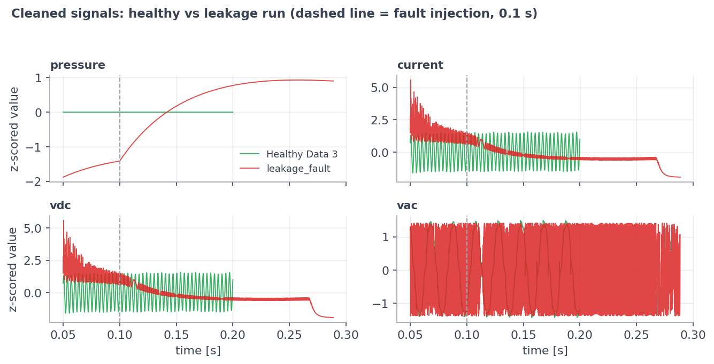
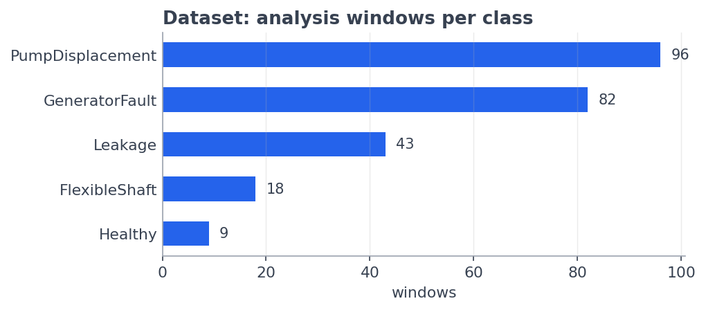
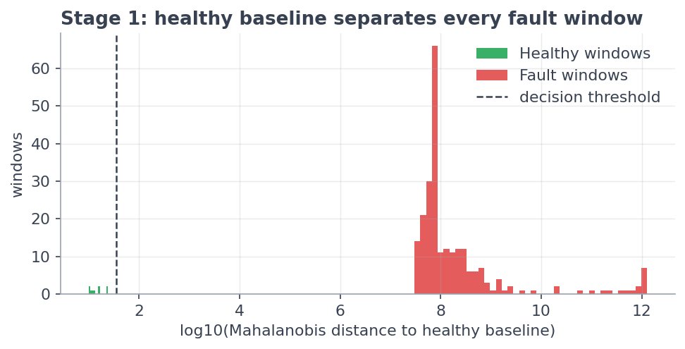
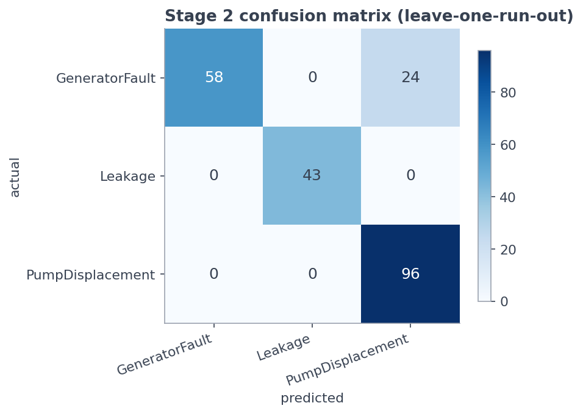
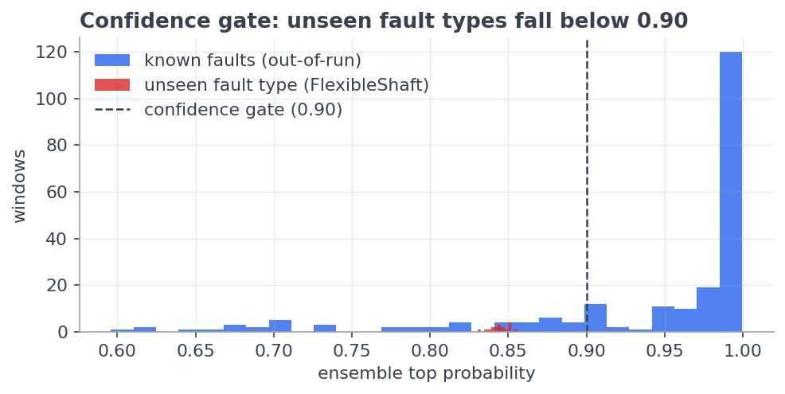

# Model-Based Predictive Maintenance of Electrical Machine

**A Two-Stage Machine-Learning System for Fault Detection and Diagnosis of an
Engine–Alternator–Hydraulic-Pump Assembly**

*Technical Project Report*

---

## Abstract

This project develops a complete machine-learning system that reads a raw sensor
log from an electrical machine assembly (diesel engine + alternator + hydraulic
pump, modelled in MATLAB Simulink/Simscape) and answers two questions: **(1) is
the machine healthy or faulty**, and **(2) if faulty, which fault is it?** The
system is built as a two-stage pipeline: Stage 1 is a one-class statistical
anomaly detector that compares every signal window against a healthy baseline
using the Mahalanobis distance; Stage 2 is a soft-voting ensemble of three tree
classifiers (Extra Trees, LightGBM, CatBoost) that names the fault, protected by
a confidence gate that routes uncertain windows to an *"Unknown fault"* verdict
instead of forcing a guess. All results are validated with leave-one-run-out
cross-validation so that the model is always tested on a simulation run it has
never seen. The final system achieves **100% fault detection**, **89.1%
diagnosis accuracy (macro F1 = 0.906)** on the named fault classes, and routes
**100% of windows from an untrained fault type** to the Unknown verdict. The
model is deployed through an interactive Streamlit web dashboard that accepts a
raw `.xlsx`/`.csv` log and returns a colour-coded verdict with confidence,
per-window timeline, and signal plots.

---

## Table of Contents

1. Introduction and Objectives
2. The Machine and the Data
3. Understanding the Data
4. Data Preprocessing
5. Windowing and Labelling
6. Feature Engineering
7. Validation Strategy
8. Model Development — Stage 1: Health Monitor
9. Model Development — Stage 2: Fault Diagnoser
10. The Confidence Gate — Open-Set Recognition
11. Results
12. Deployment — the Prediction Dashboard
13. Tools and Technologies
14. Assumptions and Limitations
15. Conclusion and Future Work

---

## 1. Introduction and Objectives

Model-based predictive maintenance (PdM) uses a physics simulation of a machine
to generate labelled fault data, then trains a data-driven classifier on it.
The objective of this project is to build, validate, and deploy a system that:

1. **Detects** whether an uploaded sensor log shows healthy or anomalous
   behaviour (fault *detection*).
2. **Diagnoses** the fault type — hydraulic **Leakage**, pump **Displacement**
   fault, or **Generator** (alternator) fault (fault *diagnosis*).
3. **Refuses to guess** when the signal pattern matches no trained fault,
   reporting *Unknown fault* instead (open-set recognition) — the correct
   behaviour for faults with insufficient training data, such as the flexible
   shaft coupling fault.
4. Produces **honest, leakage-free accuracy numbers** and ships as a
   **usable web application**.

## 2. The Machine and the Data

The plant is an **engine-driven alternator feeding a rectifier/DC bus, with an
engine-driven hydraulic pump**, modelled in Simulink/Simscape. Faults are
injected into the simulation at **t = 0.1 s**; each simulation run logs all
sensor channels at high rate until 0.2–0.5 s.

### 2.1 Fault classes and their location in the machine

| # | Class | Machine part affected | Physical effect in the signals |
|---|-------|----------------------|-------------------------------|
| 0 | **Healthy** | — (reference state) | Steady periodic behaviour of all channels |
| 1 | **Leakage** | Hydraulic pump — internal leakage path | Pump pressure collapses/relaxes toward a new level; flow-pressure relation changes |
| 2 | **PumpDisplacement** | Hydraulic pump — displacement (swash-plate/flow output) mechanism | Reduced flow output per revolution; pressure and load-current ripple pattern changes |
| 3 | **GeneratorFault** | Alternator / generator electrical side | Abnormal AC waveform, DC-bus ripple, and load-current pattern |
| 4 | **FlexibleShaft** | Engine-to-pump flexible shaft coupling | Abnormal torsional/vibration signature — *detected and routed to "Unknown fault" (see §10)* |

### 2.2 Dataset summary

| Property | Value |
|---|---|
| Source | MATLAB Simulink/Simscape simulation exports (`.xlsx` / `.csv`) |
| Simulation runs used | 12 independent runs |
| Fault injection time | t = 0.1 s (constant `FAULT_T`) |
| Run duration | 0.2 – 0.5 s per run |
| Working sampling rate | 10 kHz (uniform, after resampling) |
| Analysis windows | **248** (Table 5.1) |
| Features per window | **51** |

### 2.3 Signals and units

Only channels present in **every** run can feed a common model. Four such
channels exist and form the model input; the remainder are used for validation
and plotting.

**Table 2.3 — Parameters, symbols, and units (after harmonization)**

| Parameter | Channel name | Physical unit | Used by model |
|---|---|---|---|
| Pump outlet pressure | `pressure` | bar | ✅ |
| Load current | `current` | A | ✅ |
| DC bus voltage | `vdc` | V | ✅ |
| Alternator AC voltage | `vac` | V | ✅ |
| Shaft speed | `speed` | rpm | validation only |
| Shaft torque | `torque` | N·m | validation only |
| Hydraulic flow rate | `flow` | L/min | validation only |
| Fuel rate | `fuel` | kg/s | validation only |
| Time base | `time` | s | index |

## 3. Understanding the Data

Exploratory analysis (notebook `02_eda_signals.ipynb`) established three facts
that shaped the whole design:

1. **The runs sit at wildly different operating points.** Pump pressure spans
   0.03–4126 bar and the DC bus 26–182 V across runs. A model trained on raw
   signal *levels* would learn to recognise the operating point, not the fault.
   → Therefore **only scale-invariant and baseline-relative features** are used
   (§6).
2. **Simulink export column names drift between runs** (suffixes like `:1`,
   generic `PS-Simulink Converter` names, different capitalisation). → Therefore
   a **harmonization layer** maps every export scheme onto one canonical set of
   channel names and units (§4.1).
3. **Windows from the same run are near-duplicates of each other** (50% overlap,
   same operating point, same noise seed). → Therefore **evaluation must split
   by run, never by window** (§7).

**Figure 3.1** shows a healthy run against a leakage run after cleaning: the
pressure trajectory diverges immediately after the injection instant, while the
electrical channels change their ripple pattern.



## 4. Data Preprocessing

All preprocessing lives in one shared module (`pdm_common.py`) used identically
by training **and** by the deployed app — this guarantees zero train/serve skew.
Each step below states what it is, why it is used, and how it works.

### 4.1 Column harmonization and unit conversion
- **What:** a per-file column map resolving each export scheme to canonical
  names (`pressure`, `current`, `vdc`, `vac`, …), with unit conversion (e.g.
  Pa → bar).
- **Why:** Simulink exports the same physical scope under different column
  names in different runs; without harmonization, channels would silently drop.
- **How:** a suffix/whitespace-tolerant resolver matches raw headers; a
  channel-validation report (`channel_validation.csv`) records the unit, range,
  and accept/reject decision for every channel of every file.

### 4.2 Duplicate removal (redundant data)
- **What:** exact duplicate rows and duplicate timestamps within a run are
  counted and dropped.
- **Why:** duplicated samples would double-weight parts of the signal and
  corrupt resampling; counting first (never silently) keeps the step auditable.

### 4.3 Physically-impossible value sanitization
- **What:** values that violate physics — negative pressure, negative flow,
  negative fuel rate — are marked as missing.
- **Why:** solver glitches can emit impossible values; the bound (≥ 0) is a
  physics fact, not a tuned threshold, so the rule cannot overfit.
- **How:** flagged values become `NaN` and are filled by the same
  interpolation used for any missing data point — one imputation path only.

### 4.4 Uniform resampling to 10 kHz
- **What:** every channel is linearly interpolated onto one common 10 kHz time
  grid starting at t = 0.05 s.
- **Why:** the variable-step Simulink solver produces non-uniform timestamps;
  spectral and windowed features require a constant sampling rate. Starting at
  0.05 s discards the solver's non-physical start-up transient.

### 4.5 Outlier clipping — Hampel filter
- **What:** a rolling-median filter that replaces any sample further than a
  robust threshold (median ± k·MAD) from its local neighbourhood.
- **Why chosen over alternatives:** unlike a low-pass filter or mean smoothing,
  the Hampel filter removes isolated solver spikes **without smoothing over the
  real fault dynamics** — a genuine step change survives, a one-sample spike
  does not.
- **Assumption / limitation:** spikes are isolated; a burst of consecutive bad
  samples longer than the window would partially survive.

### 4.6 Constant-column and low-variance filtering
- **What:** a channel is dropped only if constant across the **entire dataset**
  (a channel flat in just one run is kept — it may be informative elsewhere);
  after feature extraction, features with near-zero variance across all windows
  are removed.
- **Why:** constant inputs carry no class information and only add noise
  dimensions to the covariance estimate in Stage 1.

## 5. Windowing and Labelling

The cleaned run is cut into **0.02 s windows (200 samples) with 50% overlap**,
taken from the fault-active region (t ≥ 0.1 s). Each window inherits the label
of its run. A run must yield at least 3 complete windows to be usable.

- **Why windows instead of whole runs?** Twelve runs would give only twelve
  training examples; windowing multiplies the sample count while every window
  still spans several electrical/hydraulic cycles at 10 kHz.
- **Why 50% overlap?** Standard practice in vibration/condition monitoring —
  doubles the sample count and ensures no transient falls on a window boundary.
- **Limitation:** overlapping windows from one run are statistically dependent,
  which is exactly why validation is done per run (§7).

**Table 5.1 — Analysis windows per class**

| Class | Runs | Windows |
|---|---|---|
| PumpDisplacement | 4 | 96 |
| GeneratorFault | 3 | 82 |
| Leakage | 3 | 43 |
| FlexibleShaft | 1 | 18 |
| Healthy | 1 | 9 |
| **Total** | **12** | **248** |



## 6. Feature Engineering

### 6.1 Design principle: scale invariance

Because runs sit at incompatible operating points (§3), **no feature may depend
on the absolute signal level**. Every feature is one of:

- **Scale-invariant statistics** — unitless shape descriptors that are the same
  whether the pressure is 2 bar or 2000 bar.
- **Baseline-deviation statistics** — how the signal changed after fault
  injection *relative to that same run's own pre-fault segment* (0.05–0.10 s).

### 6.2 The 51 features

Twelve statistics are computed per window for each of the four common channels,
plus three cross-signal features:

**Table 6.2 — Feature set (12 × 4 channels + 3 = 51)**

| Feature | Definition | What it captures |
|---|---|---|
| `cov` | coefficient of variation (σ/µ) | relative fluctuation strength |
| `crest` | peak / RMS | spikiness of the waveform |
| `ripple` | peak-to-peak / mean | oscillation depth |
| `skew` | third standardized moment | waveform asymmetry |
| `kurt` | fourth standardized moment | heavy tails / impulsiveness |
| `zcr` | zero-crossing rate of the detrended signal | dominant frequency proxy |
| `slope` | linear trend within the window | drift/collapse behaviour |
| `speccen` | spectral centroid | centre of gravity of the spectrum |
| `speclow` | low-band spectral power share | energy shift toward low frequency |
| `dmean` | mean change vs pre-fault baseline (normalized) | level shift after fault |
| `dstd` | std change vs baseline (normalized) | fluctuation change after fault |
| `drms` | RMS change vs baseline (normalized) | energy change after fault |
| `corr_vdc_i` | correlation(vdc, current) | rectifier/load coupling integrity |
| `power_cov` | CoV of instantaneous electrical power | combined electrical stability |
| `corr_p_vac` | correlation(pressure, vac) | hydro-electrical coupling |

### 6.3 Feature importance

Feature ranking (impurity importance averaged across the deployed ensemble's
members, cross-checked with permutation importance during development) shows
the top drivers are physically meaningful: the AC-voltage zero-crossing rate
(`vac_zcr` — generator waveform frequency content), the pressure trend and
baseline-deviation features (`pressure_slope`, `pressure_dmean` — hydraulic
collapse after a fault), and ripple/crest of the AC/DC voltages and load
current. This is evidence the model learned machine physics rather than
artifacts.


**Role in training:** the ranking is used as *evidence only* — all 51 features
enter every model. Selecting features by rank *before* cross-validation would
itself leak information from the test folds.

## 7. Validation Strategy

**Leave-one-run-out cross-validation (LOGO):** the model is trained on all runs
except one and tested on every window of the held-out run; this repeats for
every run and the predictions are pooled.

- **Why:** overlapping windows of one run are near-duplicates. A random
  window-level split would place siblings in both train and test, and the model
  would score ~99% by *recognizing the run* rather than the fault — a data
  leakage artifact. LOGO guarantees every reported number comes from a run the
  model never saw.
- **Consequence accepted:** LOGO gives fewer, harder test folds and therefore
  *lower but honest* numbers.

## 8. Model Development — Stage 1: Health Monitor

**What it is.** A one-class anomaly detector: it models *healthy behaviour
only* and measures how far any new window sits from that behaviour.

**Why one-class instead of adding "Healthy" as a 5th classifier output?** A
supervised class needs multiple independent examples to be learnable and
testable. Healthy operation is better treated as a *reference distribution*:
anything sufficiently far from it is anomalous. This mirrors industrial
condition-monitoring practice (alarm on deviation from baseline).

**How it works — three standard statistical tools:**

1. **RobustScaler** — every feature is centred by the healthy *median* and
   scaled by the healthy *IQR* (not mean/std), so single unusual values cannot
   distort the scale. After scaling, "0" means "typical healthy value".
2. **Ledoit–Wolf shrinkage covariance** — learns how healthy features co-vary.
   A plain covariance matrix is singular when samples (9 healthy windows) <
   features (51); Ledoit–Wolf blends the empirical covariance with a
   well-conditioned prior, with the blend weight chosen analytically — the
   standard estimator for exactly this small-sample regime.
3. **Mahalanobis distance** — for a new window, one number: *how many standard
   deviations of normal variation is this window from the healthy cloud, taking
   feature correlations into account?* Chosen over Euclidean distance because
   correlated features would otherwise double-count deviation.

**Decision rule:** distance ≤ 1.5 × (worst healthy window) → Healthy;
otherwise → anomalous → Stage 2. The 1.5 margin is a documented safety factor
above the empirical healthy maximum.

**Result:** every one of the 239 fault windows — all four fault types — exceeds
the threshold (100% detection), while all healthy windows fall below it.



### 8.1 Why Mahalanobis — measured against alternatives

Two standard one-class detectors were implemented and evaluated under the
identical protocol (fit on the 9 healthy windows, threshold = 1.5 × worst
healthy score, score all 239 fault windows):

**Table 8.1 — Stage 1 detector comparison**

| Detector | Fault detection | Healthy false alarms | Separation margin* |
|---|---|---|---|
| **Mahalanobis distance (deployed)** | **100%** | 0% | **≈ 1.3 × 10⁶** |
| One-Class SVM (RBF, ν = 0.1) | 100% | 0% | 907 |
| IsolationForest (300 trees) | **0%** | 0% | 1.06 |

*Separation margin = (closest fault window's score) ÷ (worst healthy window's
score); larger means the threshold sits in a wider safety band.

The result is decisive, and the mechanism explains it. **IsolationForest**
scores anomalies by how few random splits isolate a point — but with only 9
training samples its trees are shallow and its score range collapses; every
fault window scores within 6% of the worst healthy window, so no threshold
above the healthy maximum can ever fire (0% detection). **One-Class SVM**
detects everything, but its margin is ~1,400× thinner than Mahalanobis: a
modest drift in healthy behaviour could push healthy windows across its
boundary. **Mahalanobis** exploits the strong correlations between the 51
features (via the Ledoit-Wolf covariance), which places every fault window a
million-fold beyond the healthy cloud. The detector was therefore chosen by
measurement, not by preference.

**Assumptions & limitations:** healthy behaviour is unimodal and represented by
the baseline run; the false-alarm rate is measured on the same run that defined
the baseline, so a machine at a very different healthy operating point could be
flagged anomalous. More healthy reference runs would widen the baseline.

## 9. Model Development — Stage 2: Fault Diagnoser

Stage 2 answers *which fault?* for the three fault classes with multiple
independent runs. Seven classifier families were evaluated under identical
conditions (same 51 features, same LOGO folds).

### 9.1 Candidate models — what, why, how

**Table 9.1 — Candidate models**

| Model | What it is / how it works | Why it was considered | Key assumption | Main limitation here |
|---|---|---|---|---|
| **Extra Trees** | Bagging of ~500 decision trees with *random* split thresholds; majority vote | Very resistant to overfitting; near-zero tuning | Feature interactions capturable by axis-aligned splits | Random splits waste capacity when training runs are few |
| **Random Forest** | Bagging of ~500 trees, each on a bootstrap resample with random feature subsets; optimal splits | The standard strong tabular baseline | Same as above | Slightly weaker than boosting on the hardest class |
| **HistGradientBoosting** | Trees built *sequentially*, each fitting the previous ensemble's errors; histogram-binned features | Boosting focuses capacity on hard cases | Errors are informative, not noise | Needs care (small trees, slow rate) on tiny data |
| **LightGBM** | Gradient boosting with leaf-wise tree growth and histogram binning | Fast, strong, class-weight support | Same as boosting | Leaf-wise growth can overfit small data (capped at 15 leaves) |
| **CatBoost** | Gradient boosting with *ordered boosting* — each sample's residual computed from a model that never saw it | Ordered boosting is specifically designed against small-sample overfitting | Same as boosting | Slower to train |
| **SVM (RBF kernel)** | Maximum-margin boundary bent by a kernel into curved surfaces | Classical strong baseline for medium dimensions | Classes separable with smooth boundaries in kernel space | Sensitive to run-to-run distribution shift; weakest here |
| **Logistic Regression** | Linear weighted sum of standardized features → softmax probabilities | Sanity check: is the feature space linearly separable? | Linear class boundaries | No feature interactions |

### 9.2 Why an ensemble was chosen

The three best-diversified members — **Extra Trees (randomized bagging) +
LightGBM (leaf-wise boosting) + CatBoost (ordered boosting)** — are combined by
**soft voting**: their predicted probabilities are averaged and the highest
average wins.

- **Why it wins:** the members make *different kinds of mistakes*; averaging
  retains the signal they agree on and washes out individual quirks. The
  ensemble beats every individual member.
- **Second benefit:** averaged probabilities are better calibrated, which the
  confidence gate (§10) depends on.
- **Class imbalance** is handled with balanced class weights (each class
  contributes equally to the loss), not synthetic oversampling — interpolating
  overlapping windows would manufacture fake "independent" samples.

**Table 9.2 — Model comparison (identical LOGO folds)**

| Model | Macro F1 | Accuracy |
|---|---|---|
| **Voting ensemble (ET + LGBM + CatBoost)** | **0.906** | **89.1%** |
| HistGradientBoosting | 0.902 | 88.7% |
| Random Forest | 0.897 | 88.2% |
| LightGBM | 0.887 | 87.3% |
| Logistic Regression | 0.872 | 85.5% |
| Extra Trees | 0.820 | 80.1% |
| SVM (RBF) | 0.798 | 80.1% |


Logistic regression at 0.872 is itself a finding: the engineered feature space
is largely linearly separable — the feature engineering, not model complexity,
does the heavy lifting.

### 9.3 Final classifier performance

**Table 9.3 — Per-class results, voting ensemble (leave-one-run-out)**

| Class | Precision | Recall | F1 | Support |
|---|---|---|---|---|
| Leakage | 1.000 | 1.000 | 1.000 | 43 |
| PumpDisplacement | 0.800 | 1.000 | 0.889 | 96 |
| GeneratorFault | 1.000 | 0.707 | 0.829 | 82 |
| **Overall** | | **accuracy 0.891** | **macro F1 0.906** | 221 |



The single remaining confusion — generator windows read as pump displacement —
is concentrated in one generator run that was exported at a different simulation
operating point than its siblings; precision for GeneratorFault remains perfect
(no false generator alarms).

## 10. The Confidence Gate — Open-Set Recognition

**What:** the diagnoser names a fault **only when the ensemble's top probability
is ≥ 0.90**; below the gate, the window is reported as **"Unknown fault —
inspect"**.

**Why:** a 3-class classifier will force *any* anomalous window into one of its
3 classes — including a fault type it has never been trained on. In a
maintenance setting, a confident wrong label is worse than an honest "unknown".

**Validation on a genuinely unseen fault:** the FlexibleShaft coupling fault is
not part of Stage 2 training. When its windows are pushed through the deployed
model, their confidences cluster at 0.83–0.86 — **below the gate — so 100% of
them are correctly routed to Unknown fault** while Stage 1 had already flagged
them as anomalous with 100% detection. Known-fault windows pass the gate at a
78.7% rate with 86.8% accuracy on the passed windows.



### 10.1 The gate value is evidence-based, not arbitrary

A statistically "natural" alternative was tested: setting the gate at the 5th
percentile of the confidences of *correct* known-fault predictions (= 0.701,
i.e. "keep 95% of what the model gets right"). Both gates were compared on
identical out-of-run predictions:

**Table 10.1 — Gate comparison**

| Gate | Known-fault pass rate | Accuracy on passed windows | Unseen fault rejected as Unknown |
|---|---|---|---|
| **0.90 (deployed)** | 78.7% | 86.8% | **100%** |
| 0.701 (5th-percentile) | 95.0% | 89.0% | **0%** |

The percentile gate keeps more known-fault windows — but fails completely at
the gate's actual purpose: every window of the unseen fault type sails through
it and would be confidently mislabeled. The unseen fault's confidences cluster
at 0.83–0.86, *above* 0.701 but *below* 0.90. The 0.90 gate is therefore
retained on measured evidence: it is the setting that both passes the majority
of known faults and rejects 100% of the unseen fault family tested.

**Limitation:** this validation used one unseen fault family; new fault types
should be re-checked against the gate.

## 11. Results

**Table 11.1 — End-to-end system performance (all leakage-free)**

| Metric | Value |
|---|---|
| Stage 1 fault detection rate | **100%** (239/239 fault windows) |
| Stage 1 false alarms (healthy windows) | 0% |
| Stage 2 diagnosis accuracy | **89.1%** |
| Stage 2 macro F1 | **0.906** |
| Unseen fault type routed to "Unknown" | **100%** |
| End-to-end smoke test (deployed app, 5 raw logs) | **5/5 correct verdicts, 100% window agreement each** |

### 11.1 Per-run breakdown — where the remaining error actually lives

Aggregate scores hide *which* run fails. Broken down per held-out fold (each
fold = one complete run):

**Table 11.1 — Per-run diagnosis accuracy (leave-one-run-out)**

| Held-out run | True class | Predicted (windows) | Run accuracy |
|---|---|---|---|
| disp1_fault(0.5) | PumpDisplacement | Pump 19/19 | 100% |
| disp2_fault(0.3) | PumpDisplacement | Pump 19/19 | 100% |
| disp3_fault(0.2) | PumpDisplacement | Pump 19/19 | 100% |
| pump_disp(st-0.5) | PumpDisplacement | Pump 39/39 | 100% |
| Leakage_factor | Leakage | Leakage 9/9 | 100% |
| leakage_fault(0.5) | Leakage | Leakage 17/17 | 100% |
| leakage_fault(1.0) | Leakage | Leakage 17/17 | 100% |
| simplifiied-generator-fault | GeneratorFault | Generator 19/19 | 100% |
| simplifiied-generator-fault(st-0.5) | GeneratorFault | Generator 39/39 | 100% |
| simplified_generator_fault | GeneratorFault | Pump 24/24 | **0%** |

**Nine of ten runs are diagnosed perfectly.** The entire residual error of the
system is concentrated in a single run (`simplified_generator_fault`), which
was exported at a different simulation operating point than the other two
generator runs. The headline "89.1% accuracy" is therefore better read as:
*perfect diagnosis on 9/10 independent runs, with one run affected by a known
data-consistency defect* — a data-collection fix, not a modelling one.

Final decision flow per 0.02 s window:

```
window features (51)
      │
      ▼
Stage 1 · Mahalanobis distance to healthy baseline
      │  ≤ threshold ──────────────► HEALTHY
      ▼  > threshold (anomalous)
Stage 2 · voting ensemble (ET + LGBM + CatBoost)
      │  top probability ≥ 0.90 ───► NAMED FAULT
      ▼  < 0.90                      (Leakage / PumpDisplacement / GeneratorFault)
UNKNOWN FAULT — inspect
```

## 12. Deployment — the Prediction Dashboard

The trained system is frozen into a single bundle
(`artifacts/two_stage_model.joblib`: Stage 1 scaler + covariance + threshold,
Stage 2 ensemble, class names, gate) and served by a **Streamlit** web app
(`07_streamlit_app.py`):

1. User uploads a raw `.xlsx`/`.csv` Simulink log.
2. The app applies the **identical** `pdm_common.py` preprocessing and feature
   pipeline used in training (no train/serve skew).
3. Every window passes through the two-stage decision flow; the dashboard shows
   a colour-coded verdict banner, confidence, share of anomalous windows, a
   verdict-share chart, a per-window classification timeline, and the cleaned
   sensor signals — plus a plain-English glossary tab.

Because the model ships as a small file, the dashboard runs on any PC with the
code + `artifacts/` folder — the raw training data is **not** required for use.

## 13. Tools and Technologies

**Table 13.1 — Technology stack**

| Layer | Technology | Role in the project |
|---|---|---|
| Language | Python 3.11 | entire pipeline and app |
| Development | Jupyter Notebook (one notebook per pipeline stage, 00–07) | reproducible, self-documenting workflow |
| Data handling | pandas, NumPy, pyarrow, openpyxl | tables, arrays, parquet cache, Excel ingestion |
| Signal/statistics | SciPy | spectral and statistical feature support |
| Machine learning | scikit-learn | preprocessing, ExtraTrees/RF/SVM/LogReg/HistGB, Ledoit-Wolf, LOGO CV, metrics |
| Gradient boosting | LightGBM, CatBoost | ensemble members |
| Model persistence | joblib | freezing/loading the trained bundle |
| Visualisation | Matplotlib | every plot in notebooks, report, and app |
| Deployment | Streamlit | interactive prediction dashboard |
| Simulation source | MATLAB Simulink / Simscape | fault-injected machine model and data export |

## 14. Assumptions and Limitations

1. **Simulation-to-hardware gap:** all data is Simscape-generated; reported
   metrics are an upper bound until validated on physical machine data.
2. **Healthy baseline breadth:** the baseline derives from one reference run;
   healthy operation at a very different operating point may raise false
   anomalies. More healthy runs directly widen the baseline.
3. **FlexibleShaft diagnosis:** detected (100%) and safely routed to Unknown,
   but cannot be *named* until more independent runs of that fault exist.
4. **GeneratorFault recall (70.7%):** limited by one run's differing export
   settings; a re-export at the shared operating point closes the gap.
5. **Stationarity within a window:** features assume the 0.02 s window is
   locally stationary — reasonable at 10 kHz, but very fast transients inside a
   single window are averaged.
6. **Probability calibration:** a reliability check of the out-of-run
   probabilities shows the ensemble is *overconfident* in its top bin
   (predicted ≈ 0.99 vs observed ≈ 0.85), and the overconfidence traces to the
   same divergent generator run as limitation 4. Consequently the 0.90 gate is
   treated as an empirically validated decision threshold (Table 10.1), not as
   a literal probability statement — "confidence 0.95" on the dashboard should
   be read as a ranking signal, not as "95% chance of being correct".

## 15. Conclusion and Future Work

A complete, deployable predictive-maintenance system was developed for an
engine–alternator–hydraulic-pump assembly. The two-stage architecture matches
the structure of the problem: a statistical healthy baseline delivers perfect
fault *detection*, a diversified voting ensemble delivers 89.1% / 0.906 macro-F1
fault *diagnosis* under strictly leakage-free validation, and a confidence gate
gives the system the industrially essential ability to say *"I don't know —
inspect"* for fault types outside its training set. Every preprocessing choice
is either a physics fact or a documented constant, every score is produced on
runs the model never saw, and the entire pipeline — from raw Simulink export to
web-dashboard verdict — runs through one shared code path.

**Future work:** validate on hardware/experimental logs; add healthy and
flexible-shaft simulation runs to widen the baseline and promote FlexibleShaft
to a named class; re-export the divergent generator run; and extend the
dashboard with run-level trend tracking across repeated uploads.

---

*Figures: `docs/report_figures/`. Reproducible pipeline: `notebooks/00 … 07`,
robustness validation: `notebooks/08_robustness_checks.ipynb`. Deployed model:
`artifacts/two_stage_model.joblib`. Metrics: `artifacts/two_stage_metrics.json`
and `artifacts/robustness_*` files.*
